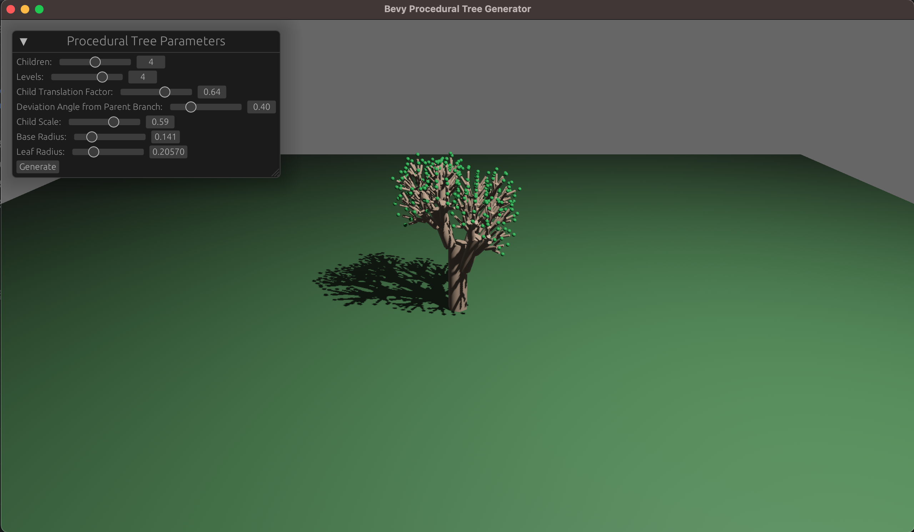

# Procedural Trees 

This bevy plugin produces procedurally generated fractal trees using very simple rules. Tree branches are indicated by cylinders. Tree leaves are approximated by spheres.

## TODO
- Enable running on web
